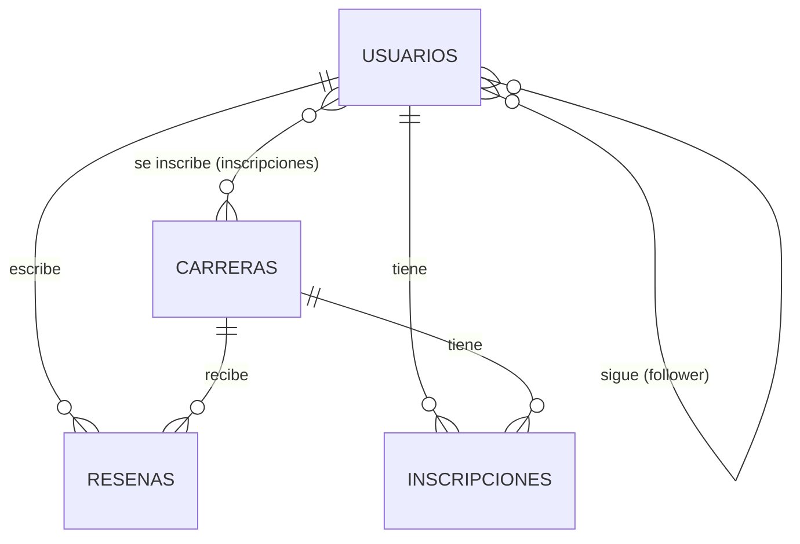

# Pacetride - Backend

Backend del Sprint 8 de Computación Móvil para Pacetride, una aplicación Android orientada a corredores de running. Expone una API REST para consultar carreras, usuarios y reseñas, construida con Node.js, Express y Sequelize sobre PostgreSQL. Esta versión no implementa autenticación.

## Tecnologías usadas

- Node.js
- Express 5
- Sequelize 6 (ORM)
- PostgreSQL (driver `pg` / `pg-hstore`)
- Morgan (dependencia instalada para logging de peticiones HTTP)
- Nodemon (recarga automática en desarrollo)

## Requisitos previos

- Node.js instalado
- PostgreSQL instalado y corriendo
- Un cliente de administración de base de datos como DBeaver o pgAdmin
- Postman para probar los endpoints

## Instalación y ejecución

1. Clonar el repositorio.
2. Instalar las dependencias:
   ```
   npm install
   ```
3. Crear en PostgreSQL una base de datos llamada `pacetride` (por ejemplo, desde DBeaver o pgAdmin, o con `createdb pacetride`).
4. Revisar los datos de conexión en `src/database/database.js` (usuario, contraseña y puerto) y ajustarlos según tu instalación local de PostgreSQL:
   ```js
   export const sequelize = new Sequelize("pacetride", "postgres", "tu_contraseña", {
     port: 5432,
     host: "localhost",
     dialect: "postgres",
   });
   ```
5. Ejecutar el proyecto en modo desarrollo:
   ```
   npm run dev
   ```
6. El servidor queda disponible en `http://localhost:3000`.

## Estructura de carpetas

- `controller`: funciones que reciben la petición HTTP, validan los datos de entrada y llaman a los modelos de Sequelize para responder con JSON.
- `database`: configuración de la conexión a PostgreSQL (`database.js`) y los scripts que cargan los datos iniciales (`initUsuarios.js`, `initCarreras.js`, `initResena.js`, `initFollowers.js`, `initInscripciones.js`).
- `models`: definición de las tablas con Sequelize (`Usuario`, `Carrera`, `Resena`, `Follower`, `Inscripcion`) y las relaciones entre ellas (`relations.js`).
- `routes`: definición de las rutas Express y su asociación con cada controlador (`usuarios.routes.js`, `carreras.routes.js`, `resenas.routes.js`).

## Modelo de datos

### Tablas y campos principales

**usuarios**
- `id`: entero, llave primaria, autoincremental
- `nombre`: texto, obligatorio
- `usuario`: texto (máx. 50), obligatorio, único
- `email`: texto, obligatorio, único, validado como email
- `ubicacion`: texto, obligatorio
- `bio`: texto largo, opcional
- `fotoPerfil`: texto (URL), opcional
- `estadisticasGlobales`: JSON con `numCarrera`, `distancia`, `mejorTiempo10k`, `mejorTiempo21k`

**carreras**
- `id`: entero, llave primaria, autoincremental
- `raceImageUrl`: texto (URL), opcional
- `nombre`: texto, obligatorio
- `fecha`: fecha, obligatorio
- `ubicacion`: texto, obligatorio
- `distanciasDisponiblesKm`: arreglo de enteros
- `precioBase`: entero, obligatorio
- `distanciaReferenciaKm`: entero (por defecto 21)
- `ultimosCupos`: booleano, opcional
- `descripcion`: texto largo, obligatorio

**resenas**
- `id`: entero, llave primaria, autoincremental
- `usuarioId`: entero, obligatorio, referencia a `usuarios.id`
- `carreraId`: entero, obligatorio, referencia a `carreras.id`
- `resena`: texto largo, obligatorio
- `calificacion`: número flotante entre 1 y 5, obligatorio

**follower**
- `id`: entero, llave primaria, autoincremental
- `followerId`: entero, obligatorio, referencia a `usuarios.id` (quien sigue)
- `followingId`: entero, obligatorio, referencia a `usuarios.id` (a quien se sigue)

**inscripciones**
- `id`: entero, llave primaria, autoincremental
- `usuarioId`: entero, obligatorio, referencia a `usuarios.id`
- `carreraId`: entero, obligatorio, referencia a `carreras.id`
- `distanciaKm`: entero, obligatorio
- `estado`: texto, `"inscrito"` o `"realizada"` (por defecto `"inscrito"`)
- `tiempo`: texto, opcional
- `ritmo`: texto, opcional

### Relaciones (definidas en `src/models/relations.js`)

- Un usuario tiene muchas reseñas (`Usuario.hasMany(Resena)` / `Resena.belongsTo(Usuario)`).
- Una carrera tiene muchas reseñas (`Carrera.hasMany(Resena)` / `Resena.belongsTo(Carrera)`).
- Un usuario puede seguir a muchos usuarios y ser seguido por muchos usuarios, a través de la tabla intermedia `follower` (relación muchos a muchos).
- Un usuario puede inscribirse en muchas carreras y una carrera puede tener muchos usuarios inscritos, a través de la tabla intermedia `inscripciones` (relación muchos a muchos).
- Adicionalmente, cada inscripción pertenece a un usuario y a una carrera (`Usuario.hasMany(Inscripcion)`, `Carrera.hasMany(Inscripcion)`), lo que permite consultar el historial y las estadísticas de cada inscripción de forma individual.



## Datos iniciales

Al iniciar el servidor (`src/index.js`), se ejecutan en orden los siguientes cargadores ubicados en `src/database`:

1. `loadInitialCarreras`: carga un listado de carreras de ejemplo en Bogotá y alrededores.
2. `loadInitialUsuarios`: carga cuatro usuarios de ejemplo con sus estadísticas globales.
3. `loadInitialResenas`: carga reseñas de ejemplo asociadas a esos usuarios y carreras.
4. `loadInitialFollowers`: carga relaciones de seguimiento entre los usuarios de ejemplo.
5. `loadInitialInscripciones`: carga inscripciones de ejemplo, algunas con estado `"realizada"` (con tiempo y ritmo) y otras `"inscrito"`.

Cada cargador solo inserta los datos si la tabla correspondiente está vacía (`count === 0`).

**Advertencia:** `src/index.js` ejecuta `sequelize.sync({ force: true })` en cada arranque del servidor, lo cual **elimina y vuelve a crear todas las tablas** antes de cargar los datos iniciales. Cualquier dato agregado o modificado manualmente se perderá al reiniciar el servidor.

## Endpoints

| Método | Ruta | Descripción | Códigos de respuesta |
|---|---|---|---|
| GET | `/usuarios/:id` | Obtiene un usuario por id | 200, 400, 404, 500 |
| GET | `/carreras` | Lista todas las carreras ordenadas por fecha ascendente | 200, 500 |
| GET | `/carreras/:id` | Obtiene una carrera por id | 200, 400, 404, 500 |
| POST | `/resenas` | Crea una reseña asociada a un usuario y una carrera | 200, 400, 404, 500 |
| PUT | `/resenas/:id` | Actualiza el texto y/o la calificación de una reseña | 200, 400, 404, 500 |
| DELETE | `/resenas/:id` | Elimina una reseña por id | 204, 400, 404, 500 |
| GET | `/carreras/:id/resenas` | Lista las reseñas de una carrera, con datos básicos del usuario y la carrera | 200, 400, 404, 500 |
| GET | `/usuarios/:id/resenas` | Lista las reseñas hechas por un usuario, con datos básicos del usuario y la carrera | 200, 400, 404, 500 |

Notas sobre los códigos:
- `400` se devuelve cuando el id no es un entero positivo o cuando falta o es inválido algún campo obligatorio del body.
- `404` se devuelve cuando el usuario, la carrera o la reseña referenciada no existe.
- `500` se devuelve ante cualquier error no controlado (por ejemplo, de conexión o de validación de Sequelize).

### Ejemplo de body para `POST /resenas`

```json
{
  "usuarioId": 1,
  "carreraId": 2,
  "resena": "Muy buena organización, la ruta estuvo bien señalizada.",
  "calificacion": 4.5
}
```

### Ejemplo de body para `PUT /resenas/:id`

```json
{
  "resena": "Actualizo mi reseña: la entrega de kits mejoró bastante.",
  "calificacion": 5
}
```

No se permite modificar `usuarioId` ni `carreraId` de una reseña existente mediante este endpoint.

## Pruebas

Las consultas a la API están guardadas en una colección de Postman, que puede importarse para probar cada endpoint sin necesidad de escribir las peticiones manualmente.
